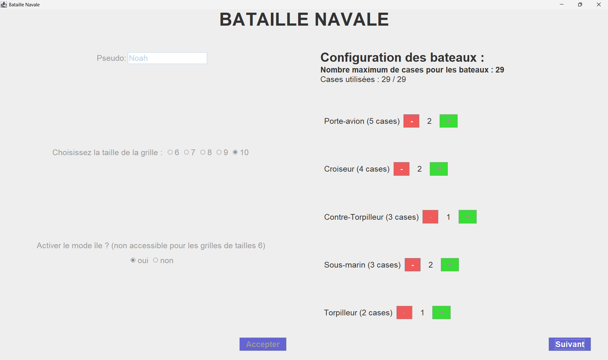
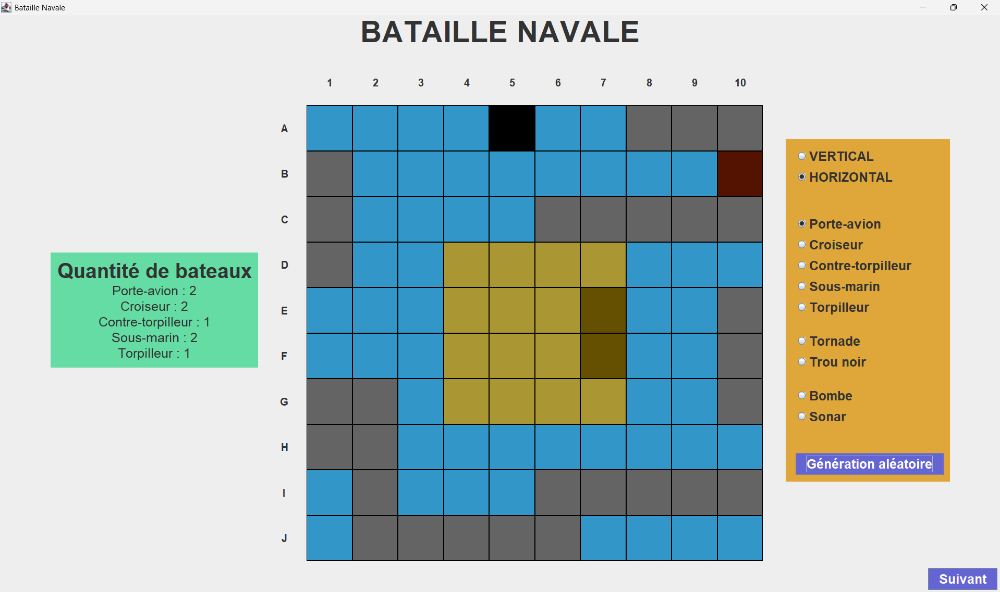
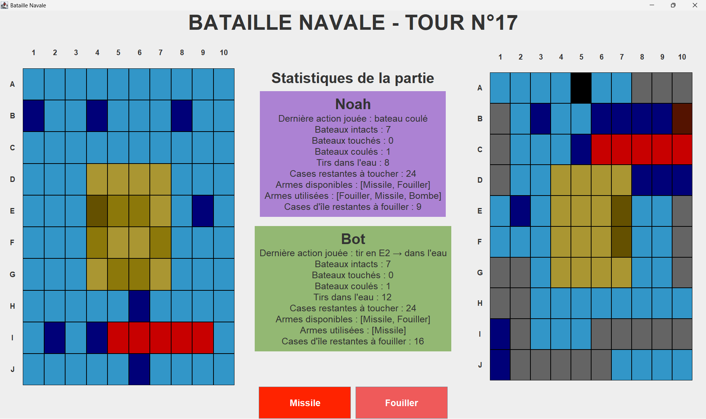
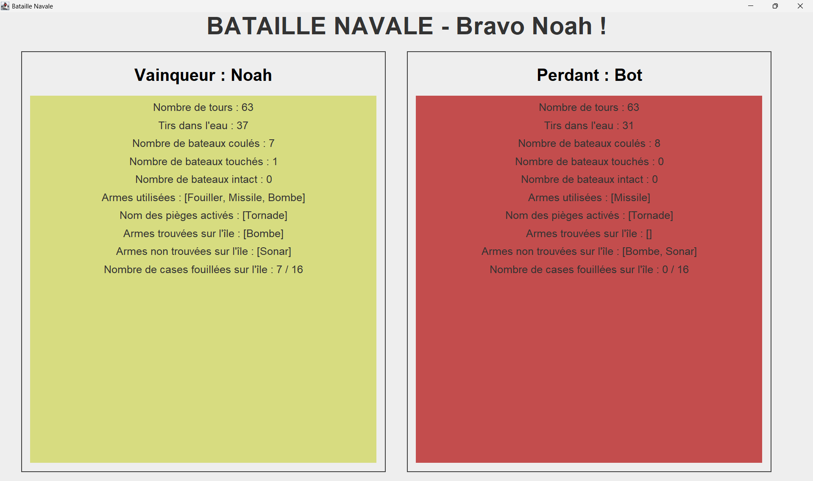

# Projet "Bataille navale"

## Table des matières
- [Description de l'application](#description-de-lapplication)
  - [Règles officielles](#règles-officielles)
  - [Règles supplémentaires](#règles-supplémentaires)
    - [Les armes](#les-armes)
    - [Les pièges](#les-pièges)
    - [Le mode alternatif](#le-mode-alternatif)
    - [Fonctionnalités demandées](#fonctionnalités-demandées-pour-le-projet-mises-en-place)
- [Technologies utilisées](#technologies-utilisées)
- [Installation et lancement](#installation-et-lancement)
- [Collaboration](#collaboration)
- [Images](#images)

## Description de l'application 

### Règles officielles

Le jeu de société comporte pour chaque joueur :

- **2 grilles de jeu de 10x10 cases**, une pour ses bateaux et une pour ceux de l'adversaire,
- **5 navires** à placer sur sa grille dont :
    - 1 porte-avion (5 cases)
    - 1 croiseur (4 cases)
    - 1 contre-torpilleur (3 cases)
    - 1 sous-marin (3 cases)
    - 1 torpilleur (2 cases)

### Règles supplémentaires

Pour pimenter le jeu, nous proposons d'ajouter 2 armes, 2 pièges et 1 mode de jeu alternatif.
<br>

#### Les armes

-------------

- La bombe :
  Elle touche la case ciblée (o) ainsi que les 4 cases à droite, à gauche, au-dessus et en-dessous (+).

```bash
-------------
|   | + |   |
-------------
| + | o | + |
-------------
|   | + |   |
-------------
```

Par défaut, chaque joueur possède une bombe à usage unique.

- Le sonar :

Il permet de savoir combien de cases sont occupées par un bateau sur la case ciblée (o) et ses 8 cases voisines (+).

```bash
-------------
| + | + | + |
-------------
| + | o | + |
-------------
| + | + | + |
-------------
```

À noter :

- Il n'indique pas où sont les cases avec un bateau parmi ces 9 cases.

Par défaut, chaque joueur possède un sonar à usage unique.
<br>
<br>
<br>

#### Les pièges

-------------

- Le trou noir :
  
Il se place comme un bateau. Lorsqu'un joueur touche un trou noir, l'attaque a en réalité lieu sur sa propre grille, aux même coordonnées.

À noter :

- le sonar considère que le trou noir est un bateau
- la bombe peut passer par le trou noir. Elle a alors l'effet de la bombe sur sa propre grille.

Par défaut, chaque joueur possède un trou noir à placer en début de partie, après ses bateaux.

Le trou noir est représenté sur les grilles de jeu par la couleur noire.

- La tornade

Malheureusement, nous n'avons pas pu implémenter ce piège dû à un manque de temps avant le rendu du projet. Cependant la tornade est quand-même plaçable sur la grille mais si elle est "activée" il ne se passera rien (cela comptera comme un tir dans l'eau).

Elle se place comme un bateau. Lorsque l'adversaire touche la tornade, ses 3 prochaines attaques auront leurs coordonnées modifiées, par exemple comme illustré ci-dessous :

```bash
    6   7   8   9  10   1   2   3   4   5
  -----------------------------------------
F |   |   |   |   |   |   |   |   |   |   |
  -----------------------------------------
G |   |   |   |   |   |   |   |   |   |   |
  -----------------------------------------
H |   |   |   |   |   |   |   |   |   |   |
  -----------------------------------------
I |   |   |   |   |   |   |   |   |   |   |
  -----------------------------------------
J |   |   |   |   |   |   |   |   |   |   |
  -----------------------------------------
A |   |   |   |   |   |   |   |   |   |   |
  -----------------------------------------
B |   |   |   |   |   |   |   |   |   |   |
  -----------------------------------------
C |   |   |   |   |   |   |   |   |   |   |
  -----------------------------------------
D |   |   |   |   |   |   |   |   |   |   |
  -----------------------------------------
E |   |   |   |   |   |   |   |   |   |   |
  -----------------------------------------
```

Note :

- les coordonnées modifiées ne sont pas affichées sur l'interface car il ne faut pas que le joueur sache où il va réellement tirer.
- le tir est consideré valide si la case initiale est valide, même si la nouvelle case de destination modifiée par la tornade a déjà été visée.
- les joueurs sont informés grâce aux panel d'informations de jeu durant toute la partie.

Par défaut, chaque joueur possède une tornade à placer en début de partie, après ses bateaux.

La tornade est représentée par la couleur bordeaux sur la grille.
<br>
<br>
<br>

#### Le mode alternatif

-------------

L'île est une zone de la grille de taille 4x4 (X) sur laquelle vont être cachées les armes spéciales décrites ci-dessus. Chaque joueur a donc le choix d'attaquer des bateaux dans l'eau ou de fouiller l'île de l'adversaire pour trouver des armes.

```bash
    1   2   3   4   5   6   7   8   9  10
  -----------------------------------------
A |   |   |   |   |   |   |   |   |   |   |
  -----------------------------------------
B |   |   |   |   |   |   |   |   |   |   |
  -----------------------------------------
C |   |   |   |   |   |   |   |   |   |   |
  ------------=================------------
D |   |   |   ||X | X | X | X||   |   |   |
  -----------------------------------------
E |   |   |   ||X | X | X | X||   |   |   |
  -----------------------------------------
F |   |   |   ||X | X | X | X||   |   |   |
  -----------------------------------------
G |   |   |   ||X | X | X | X||   |   |   |
  ------------=================------------
H |   |   |   |   |   |   |   |   |   |   |
  -----------------------------------------
I |   |   |   |   |   |   |   |   |   |   |
  -----------------------------------------
J |   |   |   |   |   |   |   |   |   |   |
  -----------------------------------------
```

À noter :

- les bateaux ne peuvent pas être placés sur l'île
- on fouille l'île de la même manière que l'on lance un missile sur un bateau
- aucune des cases ciblées par la bombe ne doit se trouver sur l'île
- le sonar ne peut pas être utilisé sur l'île
- la tornade impacte aussi les fouilles sur l'île

Si le mode île est activé, les joueurs n'ont plus que le missile par défaut, ils n'ont ni arme supplémentaire ni piège. Ceux-ci sont cachés sur l'île lors du placement.

Si la taille de la grille est de 6x6 il est impossible d'activer le mode île.

>Le nombre de cases bateaux (lors de la configuration de la partie) est calculé automatiquement en prenant en compte si le mode île est activé et la taille de la grille.

<br>
<br>
<br>

#### Fonctionnalités demandées pour le projet mises en place

-------------

- taille de la grille paramétrable de 6x6 à 10x10
- possibilités de choisir le nombre de bateaux par partie (avec maximum de cases bateaux calculé en fonction des paramètres de partie)
- placement des bateaux du bot de façon aléatoire
- placement des bateaux du joueur humain de façon personnalisé avec choix de l'orientation et de l'endroit
- tir du bot intelligent (il cherche à couler un bateau quand il le touche pour la première fois)
- détection de fin de partie automatique
- séléction de l'arme à utiliser lors de notre tour
- choix du mode île
- placement des pièges en début de partie
- visualisation de l'historique de tous les coups joués (console et interface graphique)


La possibilité de recommencer une partie après la fin de la partie n'est pas possible, il faut redemarrer l'application.

## Technologies utilisées

- **Langage** : Java, Swing
- **IDE** : Intellij IDEA
- **Méthode** : MVC

## Installation et lancement

N'hésitez pas à regarder comment installer notre jeu de bataille navale en suivant le lien ci dessous :

[Guide d'installation](INSTALL.md)

## Collaboration

Réalisation du projet de bataille navale dans le cadre d'un projet de 2ème année de BUT Informatique en binôme (avec [Lisnarde](https://github.com/Lisnarde)).

## Images
**Ecran de configuration :** <br>

Permet de choisir la taille de la grille et si le mode alternatif de l'île est activé ou non.
<br>
Il permet aussi de choisir le nombre de bateaux en fonction du nombre maximum de cases bateaux utilisable.



**Ecran de placement des bateaux :** <br>

Cet écran permet de placer les bateaux et les pièges soit de manière manuelle soit en cliquant sur le bouton **Génération aléatoire**.
<br>
Si le mode île est activé, il est possible de placer des armes sur cette île.



**Ecran de jeu :**<br>

L'écran de jeu est principalement constitué de 3 parties : notre grille, la grille du bot et les informations sur la partie en cours qui s'actualisent après chaque coup joué.
<br> 
Il est possible de différencier les bateaux touchés et les bateaux coulés grâce à leur couleur. En effet, les bateaux touchés s'affichent en orange et les bateaux qui sont coulés s'affichent en rouge.
<br>
Le numéro du tour s'actualise aussi après chaque coup joué (par le bot ou par le joueur).



**Ecran de fin de partie :** <br>

La partie se finit lorsqu'un des joueurs n'a plus aucun bateaux intact. 
<br>
L'écran affiche le vainqueur et le perdant ainsi que toutes les statistiques de la partie qui vient d'être jouée.


